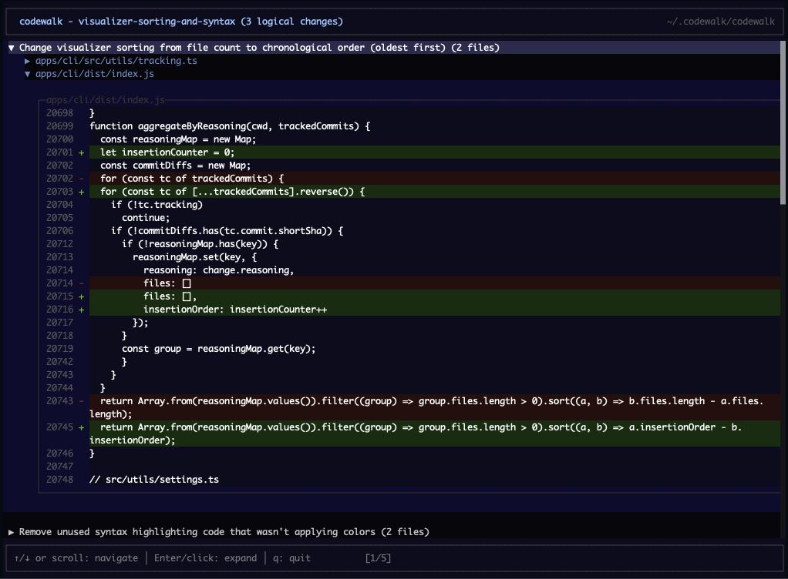

> Note: this project is in an early alpha. Any bugs can be submitted as GitHub issues


A toolkit for tracking and visualizing AI-assisted code changes with structured reasoning, known as **_logical changes_**.

## What is a "Logical Change"?

A logical change is a group of code modifications that serve a single purpose. A single commit often contains multiple logical changes - for example, adding a feature might involve:

- Adding a new component (logical change #1)
- Updating the router to include it (logical change #2)
- Adding styles (logical change #3)

Traditional diffs show these as a flat list of file changes, making it hard to understand which parts go together. Codewalk groups related hunks across files by their shared reasoning, so reviewers see changes organized by *intent* rather than by file path.

## Visualizer

Interactive TUI for viewing logical changes on the current branch:

```bash
npx codewalk visualize   # or viz
```
or
```bash
bunx codewalk visualize   # or viz
```



Groups all changes by their reasoning text across commits, sorted chronologically (oldest first). Shows the current branch, tracking directory, and actual diff hunks.

## Claude Code Plugin

### Installation

```
/plugin marketplace add lukecrum/codewalk
```
```
/plugin install codewalk
```

Once installed, Claude will automatically create tracking files for every commit via a stop hook that enforces tracking before session exit.

### Configuration

Run the interactive configuration wizard:

```
/codewalk-config
```

Or manually create `.claude/codewalk.local.md`:

```yaml
---
storage: global
globalDir: ~/.codewalk
---
```

### Settings

| Setting | Values | Default | Description |
|---------|--------|---------|-------------|
| `storage` | `local`, `global` | `global` | Where to store tracking files |
| `globalDir` | path | `~/.codewalk` | Directory for global storage (supports `~`) |

### Storage Modes

**Global storage** (`storage: global`) - Default:
- Tracking files stored in `<~ or path>/.codewalk/<repo-name>/<hash>.json`
- Best for: Personal tracking without adding files to the repo

**Local storage** (`storage: local`):
- Tracking files stored in `.codewalk/<hash>.json` in the project
- Best for: Projects where team visibility of tracking data is important

## Usage Guide

### How It Works

1. Claude makes code changes as usual
2. Claude commits immediately after changes (enforced by design)
3. Claude creates a tracking file linking reasoning to diff hunks
4. A stop hook blocks session exit until tracking is complete

### Important: Don't Interrupt the Agent Loop

**If you interrupt Claude (Ctrl+C, Escape, or closing the terminal) while it's working, the commit and tracking file will not be created.** Let Claude complete its work before ending the session.

The stop hook only runs when Claude tries to end normally—interruptions bypass it entirely. If you must interrupt:
1. Check `git status` for uncommitted changes
2. Commit manually if needed
3. Start a new session and ask Claude to create the tracking file

### Best Practices

**Let Claude finish its work**
The plugin is designed around Claude committing and tracking automatically. Avoid interrupting mid-task.

**Commit frequently**
The stop hook blocks if uncommitted changes exist. Claude is configured to commit immediately after making changes.

**Use global storage for personal tracking**
Global storage (default) keeps tracking files out of your repo.

**Use local storage for shared visibility**
Use local storage if you want tracking files in the project directory. Add `.codewalk/` to `.gitignore` if you want them untracked.

### Viewing Changes

Use the visualizer to see logical changes:

```bash
npx codewalk visualize
```

### Troubleshooting

**Session won't end / "Uncommitted changes detected"**
Run `git add -A && git commit -m "your message"` then let Claude create the tracking file.

**Session won't end / "Missing tracking file"**
Ask Claude to create the tracking file, or run `/codewalk` to trigger the skill.

**Tracking files in wrong location**
Run `/codewalk-config` to reconfigure storage settings.

**Interrupted session left uncommitted changes**
Check `git status`, commit manually, then start a new session to create the tracking file.

## Appendix A - Tracking files

### Schema

```typescript
type Changeset = {
  // Git commit SHA this changeset describes
  commit: string;

  // List of logical changes, each with its own reasoning
  changes: Change[];
};

type Change = {
  // Human-readable explanation of why this change was made.
  // Should explain the intent, not just describe what changed.
  reasoning: string;

  // Files affected by this logical change
  files: FileChange[];
};

type FileChange = {
  // Path to the file, relative to repo root
  path: string;

  // Which hunks from `git show <commit>` belong to this change.
  // 1-indexed, in order of appearance in the diff.
  hunks: number[];
};
```

### Example
```json
{
  "commit": "a1b2c3d",
  "changes": [
    {
      "reasoning": "Add dark mode toggle that persists to localStorage",
      "files": [
        { "path": "src/App.tsx", "hunks": [1, 2] },
        { "path": "src/styles.css", "hunks": [1] }
      ]
    }
  ]
}
```

## Appendix B - Visualizer controls

| Key | Action |
|-----|--------|
| `↑`/`↓` or `j`/`k` | Navigate |
| `Enter` or `Space` | Expand/collapse |
| `g`/`G` | Jump to top/bottom |
| `q` | Quit |
| Mouse scroll/click | Supported |
